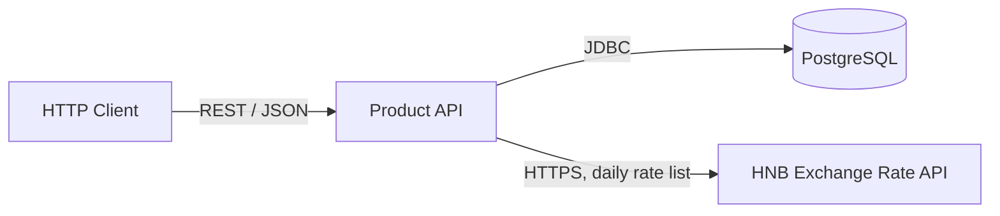

[« Architecture overview](README.md)

# 3. Context and Scope

The service has exactly two external dependencies: its own Postgres database, and the HNB
exchange rate API (`GET api.hnb.hr/tecajn-eur/v3`). This API is read-only, unauthenticated, publicly
documented API with no server-side currency filter (confirmed against the live endpoint), so
the full daily list is fetched and filtered client-side for `USD`.
