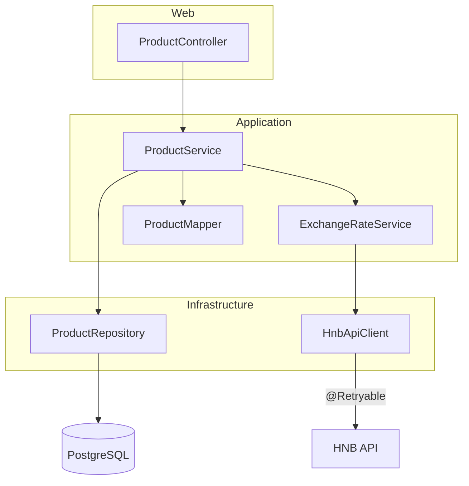

[« Architecture overview](README.md)

# 5. Building Block View

- `controller`: HTTP layer only: request/response mapping, delegates to `service`. No business
  logic lives here.
- `service`: `ProductService` (uniqueness, price computation orchestration, pagination/sort
  translation) and `ExchangeRateService` (daily rate caching).
- `client`: `HnbApiClient`, sole owner of the outbound HNB HTTP call and its retry policy.
  Deliberately separate from `service` (see
  [Architecture Decisions, ADR-3](09_architecture_decisions.md)).
- `repository`: `ProductRepository`, a plain Spring Data JPA repository.
- `mapper`: `ProductMapper`, MapStruct-generated at compile time (see
  [Architecture Decisions, ADR-4](09_architecture_decisions.md)).
- `domain`: `Product`, the one JPA entity.
- `dto`: request/response/error shapes, plus `dto.hnb` for the HNB payload shape.
- `exception`: domain exceptions plus `GlobalExceptionHandler`, the single place HTTP status
  mapping happens.
- `config`: three small `@Configuration` classes (`RestClientConfig`, `RetryConfig`,
  `OpenApiConfig`), each owning exactly one piece of cross-cutting infrastructure.
