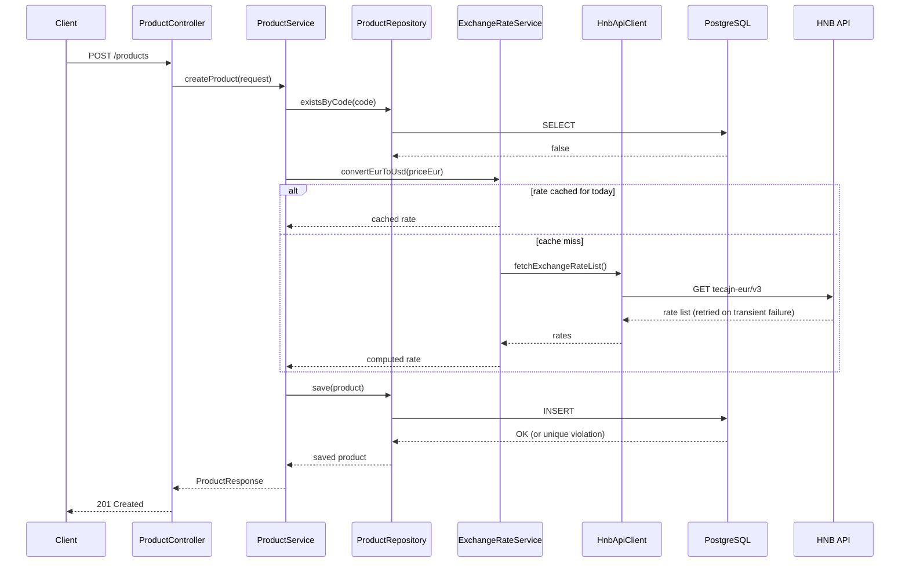

[« Architecture overview](README.md)

# 6. Runtime View

## 6.1 Creating a product (`POST /products`)

The only flow with genuine complexity — everything else is a straightforward read.

Two things the diagram doesn't show: the `existsByCode` check and the eventual `save()` aren't
atomic with each other — a genuine race between two concurrent requests with the same `code` is
still caught, because a DB-level unique violation on `save()` maps to the same `409` (see
[Architecture Decisions, ADR-5](09_architecture_decisions.md)). And the whole method
deliberately isn't wrapped in `@Transactional` (see
[Architecture Decisions, ADR-2](09_architecture_decisions.md)).
